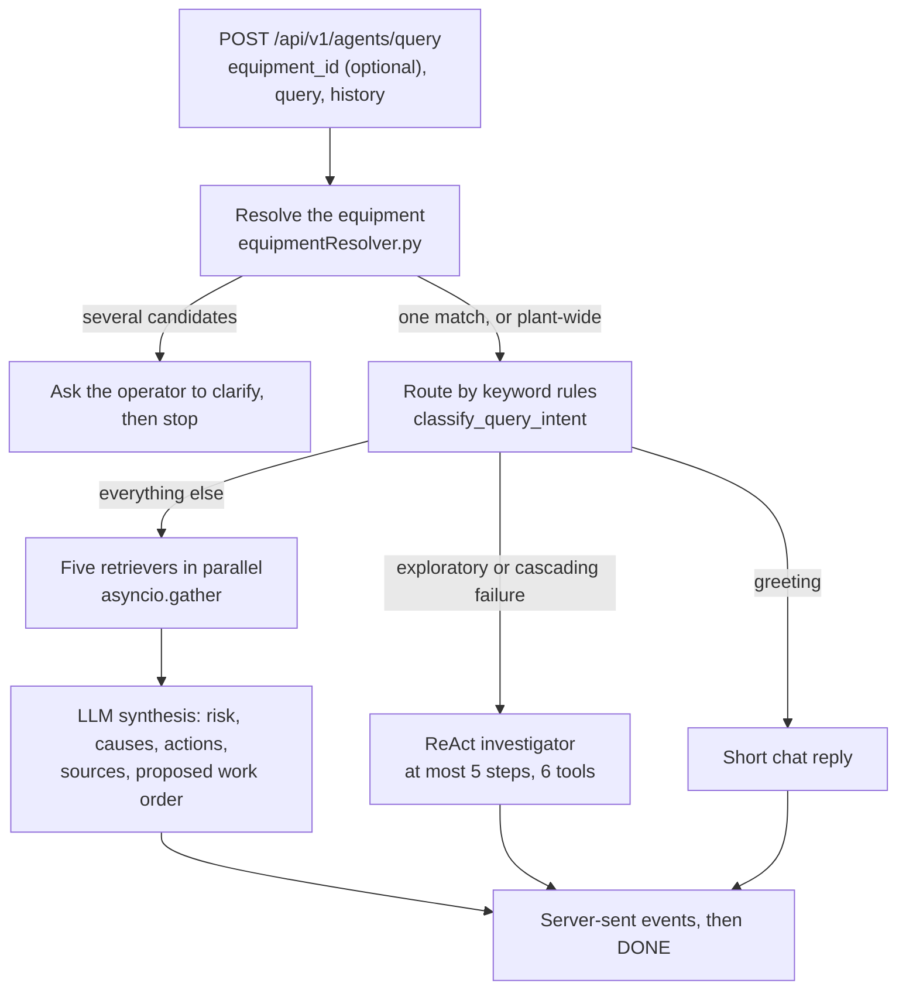
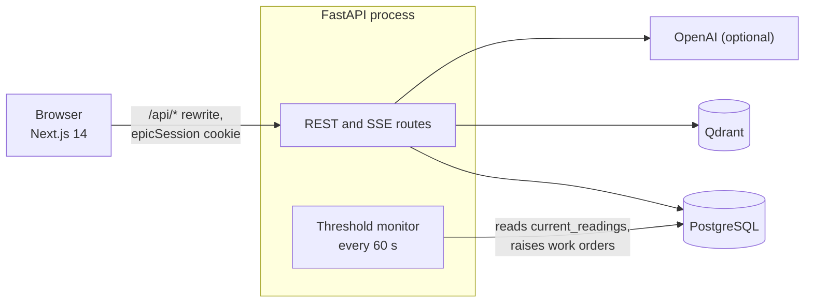

# EPIC — Industrial Intelligence

Equipment-aware question answering over plant records, documents and live telemetry.

**Stack:** FastAPI · Next.js 14 · PostgreSQL 16 · Qdrant · OpenAI (optional) · Docker Compose

An operator asks about a piece of equipment: *"Pump vibration increased today. Can I continue operating?"*
EPIC works out which equipment is meant, gathers evidence from five specialist retrievers at once, and
streams back a structured answer with a proposed work order. When the LLM or the vector database is
unavailable it keeps answering and says that it is degraded instead of pretending otherwise.

1. [How a query flows](#1-how-a-query-flows)
2. [Four guarantees](#2-four-guarantees)
3. [Quick start](#3-quick-start)
4. [Configuration](#4-configuration)
5. [Verify it yourself](#5-verify-it-yourself)
6. [API reference](#6-api-reference)
7. [Repository layout](#7-repository-layout)
8. [Known limits](#8-known-limits)
9. [Troubleshooting](#9-troubleshooting)

---

## 1. How a query flows





1. **Request.** `POST /api/v1/agents/query` takes `{equipment_id?, query, history}` from any signed-in user and
   answers with a stream of `{agent, status, message, data?}` events that ends with `data: [DONE]`
   (`backend/app/api/agents.py`).
2. **Equipment resolution.** A tag such as `P-101`, or an equipment name, in the query is matched against real
   equipment records (`backend/app/services/equipmentResolver.py`). Several candidates: the stream asks the operator
   to choose and stops. None: the question runs plant-wide.
3. **Routing.** `classify_query_intent` in `backend/app/services/llm_service.py` uses keyword rules, not an LLM call:
   greetings get a short chat reply, exploratory or cascading-failure wording goes to the ReAct investigator, and
   everything else is a standard diagnostic.
4. **Five retrievers, concurrently.** `backend/app/agents/orchestrator.py` starts them together with
   `asyncio.gather`: `equipment_brain` (the equipment record with its incidents, maintenance records, documents,
   technicians, spare parts, compliance record and downstream equipment), `maintenance_advisor` (maintenance records and similar incidents), `compliance_agent` (the stored compliance
   record), `lessons_learned` (past incidents that match the query) and `document_intelligence` (matching sections of
   ingested documents). They read PostgreSQL, Qdrant semantic search and the graph tables.
5. **Synthesis.** `synthesize_query` asks the LLM for a structured answer: risk level, probable causes, actions,
   inspection checklist, sources and a proposed work order. For multi-hop questions `run_react_stream`
   (`backend/app/agents/reactLoop.py`) lets the model call its tools (maintenance records, compliance, similar
   incidents, relevant documents, graph neighbours, stored anomalies) for at most `MAX_REACT_STEPS = 5`
   iterations, says so when it hits the cap, and downgrades claims that cite no tool evidence to `ai_inference`.
6. **Work order.** The answer only *proposes* a work order. A signed-in user saves it with
   `POST /api/v1/ops/work-orders`, technicians tick its steps and complete it. Completion is recorded as an outcome document and a
   completed maintenance record, plus a lessons-learned incident when the outcome has notes, extra steps or a failed
   fix (`backend/app/services/kb_ingestion.py`), so later questions can retrieve it.

Separately, a background monitor in the API process checks live telemetry every 60 seconds and raises a work order
when a sensor passes its alarm value (`backend/app/services/threshold_monitor.py`). Guarantee 2 is about that path.

---

## 2. Four guarantees

### 2.1 Every mutating route is authenticated, and the role checks hold

Sessions are an `httpOnly` cookie (`epicSession`) holding an HMAC-signed token, behind a swappable auth provider
(`backend/app/core/authProvider.py`). The roles that carry rights are `technician` and `supervisor` (field actions),
`supervisor` and `manager` (approvals) and `manager` alone (users, admin).

- `python scripts/checkRouteGuards.py --check` walks the live FastAPI route table and exits 1 when any POST, PUT,
  PATCH or DELETE route has no session or role guard. `login` and `logout` are the only allow-listed public routes.
- A token with a tampered signature, an expired token, a deactivated user or a token signed with another secret key
  is refused. A request with no session gets 401, and a role calling a route above its level gets 403. A forged
  `completed_by` on a work-order completion is overridden by the signed-in user. The *Access* column of the API
  table in section 6 matches the guard declared on each route.
- In production an account with no password cannot log in.
- **Not claimed:** the script proves a guard exists, not which role passes it, and it does not look at GET routes
  (section 8).

### 2.2 Numbers a model extracts from documents cannot open work orders

A work order row is created by exactly two code paths: a signed-in user posting one, and the threshold monitor
reacting to `equipment.current_readings`. That input is updated by one route, `POST /api/v1/sensors/{equipment_id}/readings`,
which requires a field role (the manager-only demo seed sets the initial values). Nothing derived from a document
writes it: readings go to `sensor_history` marked `source: document_extraction`, and with the default
`AUTO_REGISTER_ENTITIES=false` extracted entities are only held for review on the document, so a document cannot
create equipment or incidents either.

- Numbers parsed from a document never overwrite live telemetry and never trigger the threshold monitor. That holds
  with `AUTO_REGISTER_ENTITIES=true` too, even for current readings smuggled in through a document's extracted
  entities.
- A document whose entities all resolve to registered equipment is not flagged for review.
- A real breach still raises a work order: an authenticated reading past its alarm opens exactly one, and the next
  poll does not open a second.
- The statistical anomaly detector is advisory only; the threshold monitor does not import it.
- **Not claimed:** the content of a proposed work order is not independently re-verified. A signed-in user decides
  whether to save it.

### 2.3 Referential integrity is enforced by the schema

Tables come from one Alembic revision, not from a `create_all()` at startup, and the API refuses to start unless the
database is at the head revision. Exactly two foreign keys exist: `incidents.equipment_id` and
`maintenance_records.equipment_id`, both to `equipment.id` with `ON DELETE CASCADE`.

- The SQLAlchemy models match the migration, so the schema has one source.
- The API refuses to start on a database that was never migrated or is behind the head revision.
- **Not claimed:** every other reference to equipment is a plain string or JSON id list that the database does not
  check ([SCHEMA_REFERENCE.md](SCHEMA_REFERENCE.md) section 2 lists them).

### 2.4 Degradation is visible, not silent

When Qdrant is unreachable or embeddings are unavailable, vector search falls back to keyword search and says so:
`{"items": [...], "source": "keyword_fallback", "degraded": true}`. The final event of a query stream then carries
`degraded: true` and a `degraded_reason`, and `GET /api/v1/knowledge-graph/status` reports
`{qdrant_active, vector_health, degraded}`. With no LLM configured the answer says `ai_available: false` and contains
no causes, incidents or citations rather than inventing them.

- After a failed probe, vector search tries Qdrant again once the probe interval has passed, instead of staying on
  keyword search for good; when Qdrant answers, results are marked as semantic again.

---

## 3. Quick start

Needs Docker Desktop with Compose v2. An OpenAI API key is optional.

```bash
cp .env.example .env
# Edit .env: set SECRET_KEY and POSTGRES_PASSWORD (Compose refuses to start without them).
# Generate a key with:  python -c "import secrets; print(secrets.token_hex(32))"
docker compose up --build
```

| URL | What |
|---|---|
| http://localhost:3000 | The app |
| http://localhost:8000/docs | Interactive API documentation |
| http://localhost:8000/health | Liveness check |

`docker-compose.override.yml` is merged in automatically: the backend runs with `ENVIRONMENT=development` and the
source tree mounted. For a production-style run set `ENVIRONMENT=production` in `.env` and start with
`docker compose -f docker-compose.yml up --build`; that mode refuses the placeholder secrets from `.env.example`,
SQLite, and accounts without a password.

**First run.** The database starts empty.

1. Create the first user. While the `user_profiles` table is empty this call needs no credentials; afterwards only a
   manager can create users.
   ```bash
   curl -X POST http://localhost:8000/api/v1/users -H "Content-Type: application/json" \
     -d '{"employee_id":"ADMIN-001","name":"Admin","role":"manager","password":"choose-a-password"}'
   ```
2. Sign in at http://localhost:3000/login with that employee ID and password.
3. In the sidebar choose **Generate Demo Data** (manager only; it calls `POST /api/v1/admin/generate-demo`). It loads
   equipment, incidents, maintenance records, compliance records, spare parts, 30 days of sensor history, graph
   nodes, demo users and sample documents, and it is safe to run again.
4. Open **Query**, select `P-101` and ask *"Pump vibration increased today. Can I continue operating?"* With an
   OpenAI key and Qdrant running you get the full pipeline. Without them the stream still completes, the retrievers
   fall back to keyword search, and the answer is flagged as degraded (guarantee 2.4).

Local development without Docker: Python 3.11 for `backend/` (`pip install -r requirements.txt`, then
`alembic upgrade head` and `uvicorn main:app --reload`, with `DATABASE_URL` unset to use SQLite) and Node 20 for
`frontend/` (`npm ci`, then `npm run dev` with `INTERNAL_API_URL=http://localhost:8000`).

---

## 4. Configuration

Backend settings are read from the environment (and `.env`) by `backend/app/core/config.py`; the *Variable* column
uses the environment names.

| Variable | Default | Purpose |
|---|---|---|
| `OPENAI_API_KEY` | empty | LLM and embeddings. Without it the answer is the honest empty fallback and retrieval is keyword-only. |
| `OPENAI_MODEL` | `gpt-4.1` | Chat model. |
| `LLM_PROVIDER` | `openai` | `openai` or `litellm` (`backend/app/services/providers/`). |
| `EMBEDDING_PROVIDER` | `openai` | `openai` or `litellm`. |
| `QDRANT_URL` | `http://localhost:6333` | Vector database. Compose sets `http://qdrant:6333`. |
| `DATABASE_URL` | `sqlite+aiosqlite:///./epic.db` | Compose sets PostgreSQL. |
| `ENVIRONMENT` | `development` | `production` turns on the startup checks and requires passwords. |
| `AUTH_PROVIDER` | `local` | Session provider. |
| `SECRET_KEY` | a development placeholder | Signs session tokens. Production refuses the placeholders. |
| `AUTO_REGISTER_ENTITIES` | `false` | When `false`, entities extracted from documents are held for review instead of creating records. |
| `CORS_ORIGINS` | the localhost:3000 origins | Comma-separated list or JSON array. |
| `POSTGRES_PASSWORD` | none | Used by Compose for the `postgres` service and the backend's `DATABASE_URL`. |
| `INTERNAL_API_URL` | `http://backend:8000` | Frontend to backend URL, used server-side and by the `/api/*` rewrite. |
| `NEXT_PUBLIC_DEMO_MODE` | `true` in Compose | Shows the role switcher in the sidebar. |

---

## 5. Verify it yourself

Every number in this file comes from a command in this table, run on the commit that carries it. Re-run the
command before repeating the number.

| Figure | Value | Command |
|---|---|---|
| TypeScript errors | 0 | `cd frontend && npx tsc --noEmit` |
| Static pages in the production build | 15 | `cd frontend && npm run build` |
| Mutating routes: guarded / public / unguarded | 30 / 2 / 0 (32 mutating routes) | `python scripts/checkRouteGuards.py --check` |
| GET routes that require a session | 1 of 39 | `python scripts/checkRouteGuards.py --reads` |
| Database tables | 14 | `python scripts/measure_metrics.py` |
| API routers | 11 | `grep -c "app.include_router" backend/main.py` |
| Frontend pages | 12 | `python scripts/measure_metrics.py` |
| Schema reference current | yes (`--check` exits 0) | `python scripts/generateSchemaReference.py --check` |

`python scripts/generateSchemaReference.py` rewrites the generated part of `SCHEMA_REFERENCE.md`.

---

## 6. API reference

Interactive documentation is served at `/docs`. *Access* is `open` (no session required), `session` (any signed-in
user) or the roles that may call the route.

| Method | Path | Access | What it does |
|---|---|---|---|
| POST | `/api/v1/users/login` | open | Exchange credentials for the `epicSession` cookie (the token is also returned). |
| GET | `/api/v1/users/me` | session | The signed-in user. |
| POST | `/api/v1/users` | manager | Create a user (open only while no user exists). |
| POST | `/api/v1/agents/query` | session | Stream the multi-agent analysis as server-sent events. |
| POST | `/api/v1/sensors/{equipment_id}/readings` | technician, supervisor | Live telemetry; the only writer of `current_readings`. |
| GET | `/api/v1/equipment` | open | The equipment register. |
| POST | `/api/v1/equipment` | supervisor, manager | Register equipment. |
| GET | `/api/v1/equipment/{equipment_id}/brain` | open | Everything connected to one equipment: incidents, maintenance, documents, technicians, spare parts, compliance, sensor history, downstream equipment. |
| GET | `/api/v1/knowledge-graph/{equipment_id}/traverse` | open | Nodes within `depth` hops (default 2) of the equipment. |
| GET | `/api/v1/knowledge-graph/status` | open | `{qdrant_active, vector_health, degraded}`. |
| POST | `/api/v1/documents/upload` | session | Upload a document; it runs the pipeline saved, extracted, entities, graph, indexed. |
| POST | `/api/v1/documents/generate` | session | Draft a maintenance record, inspection report, operating instruction or incident report. |
| GET | `/api/v1/documents/search` | open | Search ingested documents. |
| POST | `/api/v1/ops/work-orders` | session | Save a proposed work order. |
| POST | `/api/v1/ops/work-orders/{wo_id}/complete` | technician, supervisor | Complete it with outcome feedback. |
| PATCH | `/api/v1/ops/work-orders/{wo_id}` | supervisor, manager | Edit its details. |
| POST | `/api/v1/ops/checklists` | session | Save an inspection checklist. |
| POST | `/api/v1/ops/checklists/{cl_id}/complete` | technician, supervisor | Complete it. |
| POST | `/api/v1/rca/analyze` | session | Root cause analysis for a symptom. |
| GET | `/api/v1/audit` | open | The audit trail, filterable by `object_type`, `equipment_id`, `actor`, `action` and `days` (limits: section 8). |
| POST | `/api/v1/admin/generate-demo` | manager | Load the demo dataset; safe to repeat. |
| DELETE | `/api/v1/admin/purge` | manager | Delete rows by entity (`?entity=all` for everything); the audit trail is refused. |
| GET | `/health` | open | `{"status": "ok"}`. |

---

## 7. Repository layout

| Path | Contents |
|---|---|
| `backend/main.py` | App, routers, startup checks (production configuration, migration head) and the monitor task |
| `backend/alembic/versions/` | `0001_initial_schema.py`, the only source of tables |
| `backend/app/api/` | One router per resource: admin, agents, audit, documents, equipment, knowledge graph, maintenance, rca, sensors, users, work orders |
| `backend/app/agents/` | `orchestrator.py`, `reactLoop.py`, `toolRegistry.py` |
| `backend/app/core/` | Auth, auth provider, roles, settings |
| `backend/app/db/` | SQLAlchemy models and engine |
| `backend/app/services/` | Database access, vector search, graph, LLM synthesis, equipment resolution, threshold monitor, anomaly detection, document entity mapping, knowledge-base ingestion, audit, demo documents, provider ports |
| `frontend/src/app/` | Next.js pages: dashboard, query, equipment (list and detail), sensors, rca, maintenance, work-orders, documents, graph, audit, login |
| `frontend/src/components/` | UI components |
| `frontend/src/lib/` | API client, types, contexts |
| `scripts/checkRouteGuards.py` | Route guard verification (`--check`, `--reads`) |
| `scripts/generateSchemaReference.py` | Regenerates the generated part of `SCHEMA_REFERENCE.md` (`--check`) |
| `scripts/measure_metrics.py` | Repository figures |
| `docker-compose.yml` | Four services: backend, frontend, qdrant, postgres |
| `docker-compose.override.yml` | Development overrides, merged automatically |
| `SCHEMA_REFERENCE.md` | Tables, relationships, sample SQL, audited events |

---

## 8. Known limits

These are properties of the code as it stands.

- **Read routes are open.** Only `GET /api/v1/users/me` requires a session. Every other GET route is open, including
  the audit trail, the user list (no password hashes), and `GET /api/v1/admin/demo-docs/{filename}`, which serves any
  file in `uploads/demo_samples` by name. `python scripts/checkRouteGuards.py --reads` lists them and section 5 has
  the count. The frontend already forwards the session cookie on reads (`frontend/src/lib/api.ts`), so requiring it
  is the next hardening step; the guard check covers mutating routes only. Update this bullet together with any
  change to read access.
- **The first user needs no credentials.** While `user_profiles` is empty, `POST /api/v1/users` is open, so create
  the manager immediately on any reachable deployment.
- **Outside production, an account with no password can log in.** The demo users have none. Production refuses them.
- **Sessions are stateless signed cookies with no server-side revocation.** The `epicSession` cookie contains an HMAC-signed token; logging out clears the client cookie, but the token remains valid until expiry (no server-side revocation list or blocklist).
- **The audit trail is append-only through the application only.** No code path updates or deletes its rows and the
  admin purge refuses them, but the database does not enforce it. It records the seven call
  sites listed in `SCHEMA_REFERENCE.md`, not every change: equipment, document and user changes are not recorded.
  A work order saved from an answer is attributed to the user who saved it.
- **Missing compliance data reads as compliant.** `_build_compliance_context` in `orchestrator.py` returns score 100
  and status `OK` for equipment with no compliance record, and the compliance agent reads stored records; it does
  not evaluate any standard.
- **The sample SQL has been run on SQLite only.** The statements in `SCHEMA_REFERENCE.md` have not been run on
  PostgreSQL.
- **No license file yet.** Until one is added, the default is all rights reserved.

---

## 9. Troubleshooting

| Symptom | Cause and fix |
|---|---|
| `docker compose up` stops with `Set SECRET_KEY in .env` or `POSTGRES_PASSWORD must be set` | Compose requires both; set them in `.env`. |
| Backend exits with `unsafe configuration` | `ENVIRONMENT=production` with a placeholder `SECRET_KEY` or `OPENAI_API_KEY`, or with SQLite. Set real values. |
| Backend exits with `migrations were never applied` or a revision mismatch | Run `alembic upgrade head` in `backend/`. The container entrypoint does this itself. |
| Answers say `ai_available: false` | No usable `OPENAI_API_KEY`; set one (guarantee 2.4). |
| Answers carry a degraded banner | Qdrant is unreachable or embeddings failed; check `docker compose ps qdrant` and `docker compose logs qdrant`. |
| Port 3000, 8000, 5432 or 6333 already in use | Stop the other process, or change the left-hand side of the port mapping in `docker-compose.yml`. |
| Backend logs | `docker compose logs -f backend` |
| Wipe all data and start over | `docker compose down -v` |
