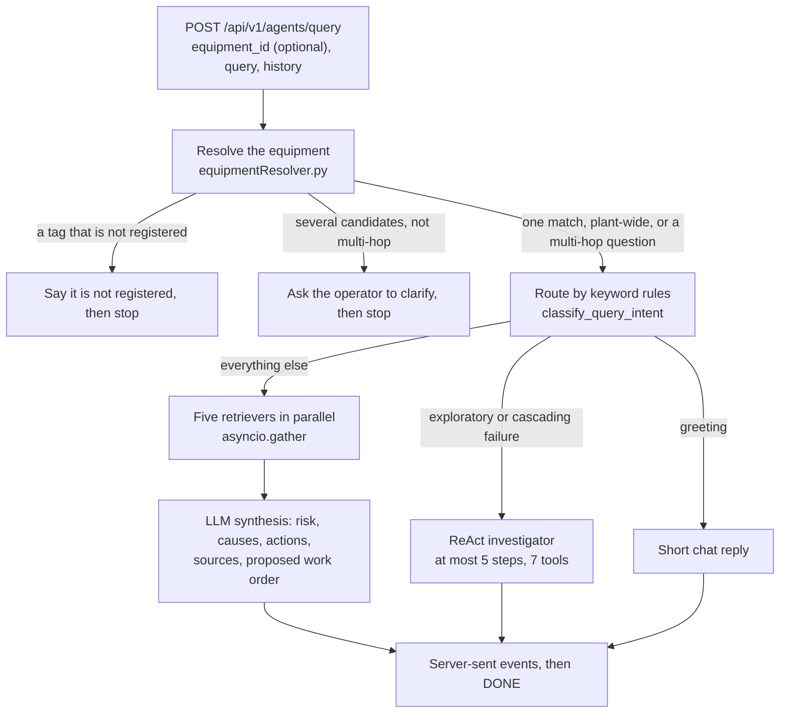
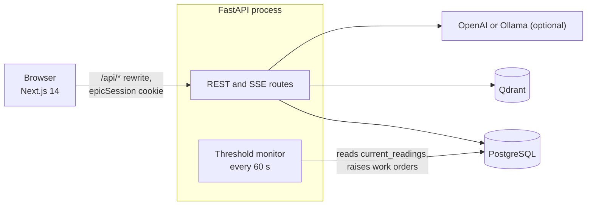

# EPIC — Industrial Intelligence

Ask questions about plant equipment and get answers grounded in its records, documents and live sensor readings.

An operator asks *"Pump vibration increased today. Can I continue operating?"* EPIC works out which pump is meant,
gathers evidence from five retrievers at once, and streams back a structured answer: risk level, likely causes,
actions, sources and a proposed work order. Without a language model or a vector database it still answers, and
says that it is running degraded.

**Stack:** FastAPI · Next.js 14 · PostgreSQL 16 · Qdrant · OpenAI or a local Ollama model (optional) · Docker Compose

1. [Quick start](#1-quick-start)
2. [Try it](#2-try-it)
3. [How it works](#3-how-it-works)
4. [Configuration](#4-configuration)
5. [Troubleshooting](#5-troubleshooting)
6. [API reference](#6-api-reference)
7. [Adding your own data](#7-adding-your-own-data)
8. [Project layout](#8-project-layout)
9. [Known limits](#9-known-limits)

---

## 1. Quick start

You need Docker Desktop with Compose v2. A language model is optional ([add one below](#add-a-model-optional)).

1. Create your settings file:
   ```bash
   cp .env.example .env
   ```
2. In `.env`, set `SECRET_KEY` and `POSTGRES_PASSWORD`; Compose refuses to start without them. To generate a value:
   ```bash
   python -c "import secrets; print(secrets.token_hex(32))"
   ```
3. Start everything:
   ```bash
   docker compose up --build
   ```
4. Open http://localhost:3000 and continue with [Try it](#2-try-it).

| URL | What |
|---|---|
| http://localhost:3000 | The app |
| http://localhost:8000/docs | Interactive API documentation |
| http://localhost:8000/health | Health check |

### Add a model (optional)

Without a model the app still runs, but answers carry no AI findings and document drafting is switched off.

- **OpenAI:** set `OPENAI_API_KEY` in `.env` and run `docker compose up` again.
- **Ollama (local):** install it from https://ollama.com/download, leave `OPENAI_API_KEY` empty, and run:
  ```bash
  ollama pull qwen2.5:7b
  ```
  ```bash
  ollama pull nomic-embed-text
  ```
  ```bash
  ollama create epic-qwen2.5 -f backend/ollama/epicChat.Modelfile
  ```
  The last command creates `epic-qwen2.5`: the same model with a 10,240-token context window instead of Ollama's
  default 4,096, which silently cuts long prompts. The backend container reaches Ollama at
  `http://host.docker.internal:11434`; if it reports Ollama as unreachable, set the environment variable
  `OLLAMA_HOST=0.0.0.0:11434` and restart Ollama.

Switching between OpenAI and Ollama changes the embedding size, so upload your documents again after switching.

### Without Docker

Python 3.11 for `backend/`: `pip install -r requirements.txt`, `alembic upgrade head`, then
`uvicorn main:app --reload` (with `DATABASE_URL` unset it uses SQLite). Node 20 for `frontend/`: `npm ci`, then
`npm run dev` with `INTERNAL_API_URL=http://localhost:8000`.

---

## 2. Try it

1. **Sign in.** On the login page, under **Demo Quick Sign-In**, choose **Demo Manager**. There is one demo account
   per role (`DEMO-TECHNICIAN`, `DEMO-SUPERVISOR`, `DEMO-MANAGER`), and they exist only in development.
2. **Load the demo plant.** In the sidebar choose **Generate Demo Data** and confirm. It loads equipment, 30 days of
   sensor readings, incidents, maintenance history, compliance records, spare parts, technicians and the knowledge
   graph. You can run it again at any time.
3. **Ask a question.** Open **AI Query**, select `P-101` and ask *"Pump vibration increased today. Can I continue
   operating?"* Watch the retrievers report in, then read the answer, its sources and the proposed work order. With a
   7B local model on a laptop GPU an answer takes one to two minutes.
4. **Work the order.** Open the answer's **Work Order** and choose **Save Work Order**. Sign out, sign in as
   **Demo Supervisor**, open **Work Orders** and tick every step of the saved order. Under the last step choose
   **Submit feedback**, say whether the fix worked and add a note. The outcome becomes part of P-101's history, so
   the next question about P-101 can use it. The threshold monitor will also have opened a work order of its own
   for the pump.
5. **Upload a document.** The window that opens after step 2 offers three sample files (two PDF reports and a shift
   handover). Download them and drop them on the **Documents** page to watch the extraction pipeline run.
6. **See it degrade.** With a model configured, run `docker compose stop qdrant` and ask again: the answer still
   arrives, marked as degraded. `docker compose start qdrant` brings semantic search back.

### The demo story

Every date is relative to the moment you generate the demo, so the records, sensor data and sample documents
agree. Names, procedures and limits are fictional.

- **P-101 Crude Oil Feed Pump.** A vibration check 8 days ago found drive-end bearing damage. Overnight, vibration
  crossed its 7.1 mm/s alarm and the bearing temperature crossed 75 °C. There is no installed spare, and in 2022
  this pump seized within 18 hours of running above the alarm. The day shift has to decide: keep running or stop?
- **K-401 Process Air Compressor.** A choked inlet filter was replaced 14 days ago, yet discharge pressure is
  falling again. The latest inspection points at intercooler fouling, and a work order to clean it is open.
- **P-202 Reflux Pump.** An old incident that looked like P-101's bearing failure turned out to be cavitation: the
  counter-example the lessons retriever should surface.

---

## 3. How it works





1. **Find the equipment.** A tag such as `P-101`, or an equipment name, is matched against the equipment register
   (`backend/app/services/equipmentResolver.py`). An unregistered tag is not analysed, several matches get a
   clarifying question, and no match runs the question plant-wide.
2. **Route the question.** Keyword rules (`classify_query_intent` in `backend/app/services/llm_service.py`) send
   greetings to a short reply, open-ended or cascading-failure questions to the ReAct investigator, and everything
   else to the standard diagnosis.
3. **Gather evidence.** Five retrievers run in parallel (`backend/app/agents/orchestrator.py`): the equipment's own
   record, its maintenance history, compliance, similar past incidents and matching document sections. The
   investigator instead calls seven read-only tools, at most `MAX_REACT_STEPS = 5` times
   (`backend/app/agents/reactLoop.py`).
4. **Answer from the data only.** The model receives the evidence as untrusted data and is told to name only what it
   contains. Its answer is then checked (`backend/app/services/answerGrounding.py`): a source no retriever returned
   is marked as AI inference, and a record id found nowhere in the evidence or the question is replaced by
   `[unverified reference]`.
5. **Close the loop.** The answer only *proposes* a work order. When a person saves and completes it, the outcome is
   stored as a maintenance record, plus a lessons-learned incident when it has notes, extra steps or a failed fix,
   so later questions can find it.

A background monitor also checks live readings every 60 seconds and opens a work order when a sensor passes its
alarm (`backend/app/services/threshold_monitor.py`).

### What it guarantees

- **Only signed-in users with the right role can change anything.** Every POST, PUT, PATCH and DELETE route apart
  from login and logout has a session or role guard, and `python scripts/checkRouteGuards.py --check` fails if one
  does not. There are three roles (`backend/app/core/roles.py`): technicians and supervisors do field work,
  supervisors and managers approve, and managers administer. The AI never writes anything itself.
- **A document cannot open a work order.** Work orders come only from a person or from the threshold monitor, and
  the monitor acts only on live readings, which only a signed-in technician or supervisor can post (the demo seed
  sets the first values). Numbers extracted from documents go to sensor history only, extracted entities are held
  for review by default (`AUTO_REGISTER_ENTITIES=false`), and a value is kept only if the document text contains it.
- **The schema enforces its core references.** Tables come from one Alembic migration, the API refuses to start on a
  database that is not fully migrated, and incidents and maintenance records reference equipment through foreign
  keys. Other equipment references are plain columns the database does not check.
- **Failure is visible.** Without Qdrant, search falls back to keywords and the answer is flagged `degraded`. Without
  a model, the answer says `ai_available: false` and invents nothing.

---

## 4. Configuration

Backend settings are read from the environment (and `.env`) by `backend/app/core/config.py`; the *Variable* column
uses the environment names.

| Variable | Default | Purpose |
|---|---|---|
| `OPENAI_API_KEY` | empty | OpenAI access; when set, OpenAI is used for chat and embeddings, otherwise Ollama (`backend/app/services/providers/modelRegistry.py`). With no key and no running Ollama, answers carry no findings, document generation is refused, and retrieval is keyword-only. |
| `OPENAI_MODEL` | `gpt-4.1` | OpenAI chat model. |
| `OLLAMA_BASE_URL` | `http://localhost:11434` | Ollama server. Compose sets `http://host.docker.internal:11434`. |
| `OLLAMA_CHAT_MODEL` | `epic-qwen2.5` | Ollama chat model: Qwen 2.5 7B with a larger context window (`backend/ollama/epicChat.Modelfile`); it must support tool calling for multi-hop questions. |
| `OLLAMA_EMBEDDING_MODEL` | `nomic-embed-text` | Ollama embedding model. |
| `OLLAMA_EMBEDDING_DIMENSION` | `768` | Vector size of `OLLAMA_EMBEDDING_MODEL`; a vector of any other size is refused. |
| `QDRANT_URL` | `http://localhost:6333` | Vector database. Compose sets `http://qdrant:6333`. |
| `DATABASE_URL` | `sqlite+aiosqlite:///./epic.db` | Compose sets PostgreSQL. |
| `ENVIRONMENT` | `development` | `production` turns on the startup checks and requires passwords. |
| `AUTH_PROVIDER` | `local` | Session provider. |
| `SECRET_KEY` | a development placeholder | Signs session tokens. Production refuses the placeholders. |
| `AUTO_REGISTER_ENTITIES` | `false` | When `false`, entities extracted from documents are held for review instead of creating records. |
| `CORS_ORIGINS` | the localhost:3000 origins | Comma-separated list or JSON array. |
| `POSTGRES_PASSWORD` | none | Used by Compose for the `postgres` service and the backend's `DATABASE_URL`. |
| `INTERNAL_API_URL` | `http://backend:8000` | Frontend to backend URL, used server-side and by the `/api/*` rewrite. |

### Production-style run

`docker-compose.override.yml` is merged in automatically and runs the backend in development mode with its source
mounted. For a production-style run, set `ENVIRONMENT=production` in `.env` and start with
`docker compose -f docker-compose.yml up --build`. That mode refuses the placeholder secrets, SQLite, accounts
without a password and active demo accounts, so create the first user yourself; it must be a manager:

```bash
curl -X POST http://localhost:8000/api/v1/users -H "Content-Type: application/json" \
  -d '{"employee_id":"ADMIN-001","name":"Admin","role":"manager","password":"choose-a-password"}'
```

---

## 5. Troubleshooting

| Symptom | Cause and fix |
|---|---|
| `docker compose up` stops with `Set SECRET_KEY in .env` or `POSTGRES_PASSWORD must be set` | Compose requires both; set them in `.env`. |
| Backend exits with `unsafe configuration`, or says demo accounts are active | `ENVIRONMENT=production` with a placeholder `SECRET_KEY`, with SQLite, or with a demo account (`DEMO-TECHNICIAN`, `DEMO-SUPERVISOR`, `DEMO-MANAGER`) still active. Set real values, and deactivate each demo account. |
| Backend exits with `migrations were never applied` or a revision mismatch | Run `alembic upgrade head` in `backend/`. The container entrypoint does this itself. |
| Answers say `ai_available: false`, or document generation says AI is unavailable | No model available: set `OPENAI_API_KEY`, or start Ollama and pull `OLLAMA_CHAT_MODEL` (`ollama list` shows what is pulled). |
| Answers carry a degraded banner | Qdrant is unreachable or embeddings failed; check `docker compose ps qdrant` and `docker compose logs qdrant`. |
| Port 3000, 8000, 5432 or 6333 already in use | Stop the other process, or change the left-hand side of the port mapping in `docker-compose.yml`. |
| Backend logs | `docker compose logs -f backend` |
| Wipe all data and start over | `docker compose down -v` |

---

## 6. API reference

Interactive documentation is served at `/docs`. *Access* is `open` (no session required), `session` (any signed-in
user) or the roles that may call the route.

| Method | Path | Access | What it does |
|---|---|---|---|
| POST | `/api/v1/users/login` | open | Exchange credentials for the `epicSession` cookie (the token is also returned). |
| GET | `/api/v1/users/me` | session | The signed-in user. |
| POST | `/api/v1/users` | manager | Create a user (open only while no user exists, and then only for a manager). |
| PATCH | `/api/v1/users/{user_id}` | manager | Change a user's role or details; demoting or deactivating the last active manager is refused (409). |
| POST | `/api/v1/agents/query` | session | Stream the multi-agent analysis as server-sent events. |
| POST | `/api/v1/sensors/{equipment_id}/readings` | technician, supervisor | Live telemetry for declared sensors; the only writer of `current_readings`, and each reading is added to the sensor's history. |
| GET | `/api/v1/equipment` | open | The equipment register, with each reading's alarm status in `reading_status`. |
| POST | `/api/v1/equipment` | supervisor, manager | Register equipment, optionally with its sensors (unit and alarm limits). |
| GET | `/api/v1/equipment/{equipment_id}/brain` | open | Everything connected to one equipment: incidents, maintenance, documents, technicians, spare parts, compliance, sensor history, downstream equipment. |
| GET | `/api/v1/knowledge-graph/{equipment_id}/traverse` | open | Nodes within `depth` hops (default 2) of the equipment. |
| GET | `/api/v1/knowledge-graph/status` | open | `{qdrant_active, vector_health, degraded}`. |
| POST | `/api/v1/documents/upload` | session | Upload a document, optionally with an `equipment_id` form field naming the registered equipment it is about (404 otherwise), which stays linked; it runs the pipeline saved, extracted, entities, graph, indexed. |
| DELETE | `/api/v1/documents/{doc_id}` | supervisor, manager | Delete a document with its file, search-index points, graph links, filename on its equipment, the incidents and defects it created, and the sensor readings extracted from it. |
| POST | `/api/v1/documents/generate` | session | Draft a maintenance record, inspection report, operating instruction or incident report (needs a model: `OPENAI_API_KEY` or Ollama). |
| POST | `/api/v1/documents/save-generated` | session | Save a draft, marked `origin: ai_draft` with who saved it; it links only equipment that exists and never registers any. |
| GET | `/api/v1/documents/search` | open | Search ingested documents. |
| POST | `/api/v1/ops/work-orders` | session | Save a proposed work order for registered equipment; steps are validated and saved unticked. |
| POST | `/api/v1/ops/work-orders/{wo_id}/chat` | session | Ask the work-order assistant; its proposed changes are cut to what the caller's role may apply and the rest are named in `withheld_changes`. |
| POST | `/api/v1/ops/work-orders/{wo_id}/complete` | technician, supervisor | Complete it with outcome feedback, once: a completed work order refuses another completion or step change (409), and its maintenance record moves from Scheduled to Completed. |
| PATCH | `/api/v1/ops/work-orders/{wo_id}` | supervisor, manager | Edit its details. |
| POST | `/api/v1/admin/generate-demo` | manager | Load the demo dataset; safe to repeat. |
| DELETE | `/api/v1/admin/purge` | manager | Delete rows by entity (`?entity=all` for everything) and the search-index points that copy purged incidents or documents; the audit trail is refused. |
| GET | `/health` | open | `{"status": "ok"}`. |

---

## 7. Adding your own data

| Way in | Where (who) | What it writes |
|---|---|---|
| Upload a document | **Documents** page (any signed-in user) | Text chunks in the search index and links to equipment that exists; with `AUTO_REGISTER_ENTITIES=true` also equipment, incidents and sensor-history points |
| Save, then complete, a work order | A query answer, **Work Orders** page | The work order and maintenance records; completing it with notes, extra steps or a failed fix adds a lessons-learned incident |
| Create a document with AI | **Documents** page | A document in the database and the graph, not the search index |
| Register equipment | `POST /api/v1/equipment` (supervisor, manager) | The equipment and the sensors it declares |
| Live readings | `POST /api/v1/sensors/{equipment_id}/readings` (technician, supervisor) | Each declared sensor's value and a point on its history |
| Create a user | `POST /api/v1/users` (manager) | An account; technicians and supervisors appear in technician lists |

Readings are accepted only for sensors the equipment declares, so register equipment with its sensors:

```json
{"id": "P-305", "name": "Booster Pump", "type": "Centrifugal Pump",
 "sensors": {"vibration_de": {"unit": "mm/s", "normal": 2.5, "alarm": 4.5, "trip": 7.1},
             "suction_pressure": {"unit": "bar", "normal": 3.0, "alarm": 2.0, "trip": 1.5}}}
```

An alarm below normal is a low alarm (or set `"alarm_direction"`), and the trip must sit at or beyond the alarm in
that direction. A sensor shows no value until its first reading, and its history keeps the newest 500 points.

---

## 8. Project layout

| Path | Contents |
|---|---|
| `backend/main.py` | App, routers, startup checks and the threshold monitor task |
| `backend/alembic/versions/` | `0001_initial_schema.py`, the only source of tables |
| `backend/app/api/` | One router per resource: admin, agents, documents, equipment, knowledge graph, maintenance, sensors, users, work orders |
| `backend/app/agents/` | The query orchestrator, the ReAct investigator and its tools |
| `backend/app/core/` | Auth, roles, settings |
| `backend/app/db/` | SQLAlchemy models and engine |
| `backend/app/services/` | Retrieval and vector search, LLM synthesis and answer checks, the document pipeline, the threshold monitor, the demo data and the model providers |
| `backend/ollama/` | `epicChat.Modelfile`, the local chat model definition |
| `frontend/src/app/` | Next.js pages: dashboard, query, equipment, sensors, maintenance, work orders, documents, graph, login |
| `frontend/src/components/` | UI components |
| `frontend/src/lib/` | API client, types, the signed-in user, roles, sensor display |
| `scripts/checkRouteGuards.py` | Route guard check (`--check`, `--reads`) |
| `scripts/measure_metrics.py` | Repository figures |
| `docker-compose.yml` | Four services: backend, frontend, qdrant, postgres |
| `docker-compose.override.yml` | Development overrides, merged automatically |

---

## 9. Known limits

- **Read routes are open.** Only `GET /api/v1/users/me` requires a session. Every other GET route is open, including
  the user list (without password hashes) and `GET /api/v1/admin/demo-docs/{filename}`, which serves any
  file in `uploads/demo_samples` by name. `python scripts/checkRouteGuards.py --reads` lists them.
- **The first user needs no credentials.** While no user exists, `POST /api/v1/users` is open (and must create a
  manager), so create the manager straight away on any reachable deployment. The last active manager cannot be
  demoted or deactivated.
- **Outside production, accounts without a password can log in.** That is how the demo accounts work; production
  refuses them.
- **Logging out does not revoke a session.** The signed `epicSession` cookie stays valid until it expires.
- **The audit trail is partial.** It records sensor updates, purges, and work-order creation and completion, not
  equipment, document or user changes, work-order edits or step ticks. The application never edits it, but the
  database does not prevent that.
- **Held entities have no approve button.** Register missing equipment with `POST /api/v1/equipment`, or set
  `AUTO_REGISTER_ENTITIES=true` before uploading to let documents create records.
- **Sensors are declared once.** Only `POST /api/v1/equipment` declares sensors and their limits, and nothing changes
  them later. There is no screen for registering equipment or entering readings, no bulk import (a CSV or
  spreadsheet upload is read as text, its first 8,000 characters), and spare parts and technicians come only from
  the demo seed.
- **Compliance is what is stored.** No standard is evaluated, and equipment without a record shows
  `No compliance record`.
- **Old document readings cannot be traced.** Deleting a document removes the readings it created, but readings
  stored before 2026-09-25 carry no document id, so they stay.
- **AI drafts count as evidence.** A saved AI draft (`origin: ai_draft`) is searchable like any other document. The
  prompts tell the model not to rely on a draft alone for a safety claim, but no code enforces that.
- **Long conversations are trimmed.** Only the newest 2,000 characters of history reach the model, and the API
  refuses more than 40 turns or a turn over 8,000 characters.
- **The answer checks read text, not meaning.** Only upper-case record ids with a known prefix are checked, an
  extracted value is checked for being in the text but not for belonging to the right entity, and dates are not
  checked.
- **Local models are weaker at structured output.** A 7B Ollama model follows JSON schemas and tool calls less
  reliably than GPT-4.1; a malformed reply shows as "AI unavailable" rather than a wrong answer. Qwen 2.5 7B was
  chosen over llama3.1 8B and Gemma 4 in an informal side-by-side on a 6 GB laptop GPU (2026-09-25); on that GPU
  part of the model runs on the CPU (`ollama ps` shows the split), which sets the speed.
- **Some muted text is low-contrast.** In both themes some muted text is below the WCAG AA ratio of 4.5:1.
- **No license file yet.** Until one is added, the default is all rights reserved.
