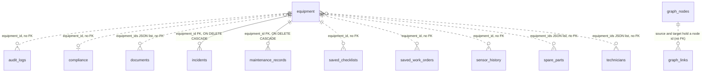

# EPIC — Database Schema Reference

PostgreSQL in Docker Compose, SQLite for local development. Tables are created only by the Alembic revision in
`backend/alembic/versions/`: `backend/entrypoint.sh` runs `alembic upgrade head` before the API starts, and
`backend/main.py` refuses to start unless the database is at the head revision. Section 4 is rewritten by
`scripts/generateSchemaReference.py` from the models and the code; everything else in this file is written by hand.

## 1. What each table is for

| Table | Purpose |
|---|---|
| `equipment` | The asset register: identity, status, criticality, health scores and `current_readings` (live sensor values with their normal, alarm and trip thresholds; alarm direction is evaluated explicitly via `alarm_direction` or inferred as low alarm when `alarm < normal`, otherwise high alarm). The authenticated telemetry endpoint is the only route that updates `current_readings` (the demo seed sets the initial values), and it is the only input the threshold monitor acts on. |
| `incidents` | Past failures: symptom, root cause, action taken, lessons learned, downtime and cost. Read by the lessons-learned retriever. Foreign key to `equipment`. |
| `maintenance_records` | Preventive and corrective maintenance history per equipment; saving a work order writes a scheduled record here and completing it writes a completed one. Foreign key to `equipment`. |
| `compliance` | One row per equipment: overall score, status, open issues and passed checks. Keyed by `equipment_id`, not a foreign key. |
| `documents` | Uploaded or generated documents: extracted sections and entities, per-step pipeline state and the stored file path. Review flags such as `entities_pending_review` live in the `extra` JSON column. |
| `spare_parts` | Parts inventory: the equipment each part fits (`equipment_ids` JSON list), stock level, reorder point and lead time. |
| `technicians` | People with their expertise, certifications and equipment (`equipment_ids` JSON list). |
| `sensor_history` | One row per equipment and sensor holding a JSON list of readings, capped at 500 entries. Document extraction appends here with `source: document_extraction`. |
| `graph_nodes`, `graph_links` | The knowledge graph as two tables: nodes, and labelled links between node ids. Walked by the breadth-first search in `get_equipment_neighbourhood`. |
| `saved_work_orders` | Work orders saved from an AI answer or raised by the threshold monitor (ids starting `AUTO-WO-`), with steps, parts, precautions and completion feedback. |
| `saved_checklists` | Inspection checklists saved from an AI answer, with per-item state. |
| `user_profiles` | Accounts: role, PBKDF2 password hash and active flag. |
| `audit_logs` | The audit trail, append-only through the application. Section 4 lists which events write it. |

## 2. Relationships and integrity

Two references are enforced by the database: `incidents.equipment_id` and `maintenance_records.equipment_id`, both
foreign keys to `equipment.id` with `ON DELETE CASCADE`. Every other reference to equipment is a plain string column
(`sensor_history`, `saved_work_orders`, `saved_checklists`, `audit_logs`, and `compliance` as its primary key) or a JSON
id list (`documents`, `spare_parts`, `technicians`); the database does not check those, and deleting an equipment row
leaves them in place.

No route deletes a single equipment row. Rows leave `equipment` only through the admin purge, and there the two
foreign keys cascade.

PostgreSQL enforces foreign keys natively. On SQLite the engine turns `PRAGMA foreign_keys` on for every new connection
(`backend/app/db/database.py`), because the pragma is per-connection.

The migration downgrades to base and upgrades again cleanly, and `alembic check` reports any model change that has
no migration.

## 3. Sample SQL

The statements below use standard SQL only. They were run against a freshly migrated SQLite database, not on
PostgreSQL.

Automatic work orders that are still open:

```sql
SELECT id, equipment_id, wo_type, risk_level, status
FROM saved_work_orders
WHERE id LIKE 'AUTO-WO-%' AND status IN ('open', 'in_progress')
ORDER BY created_at DESC;
```

Equipment ranked by recorded incidents:

```sql
SELECT e.id, e.name, COUNT(i.id) AS incident_count
FROM equipment e
LEFT JOIN incidents i ON i.equipment_id = e.id
GROUP BY e.id, e.name
ORDER BY incident_count DESC, e.id;
```

Everything the audit trail recorded about one work order (replace the id):

```sql
SELECT timestamp, action, actor
FROM audit_logs
WHERE object_type = 'work_order' AND object_id = 'WO-1A2B3C4D'
ORDER BY id;
```

Deleting equipment removes its incidents and maintenance records with it, and nothing else:

```sql
DELETE FROM equipment WHERE id = 'P-101';
```

## 4. Generated reference

<!-- BEGIN GENERATED: schema -->

14 tables · Alembic head revision `0001_initial_schema`.



### `audit_logs` — AuditLog

Append-only audit trail entry. Written when a work order or checklist is created or completed, when live telemetry is ingested and when an admin purge is requested; SCHEMA_REFERENCE.md lists the exact call sites. No code path updates or deletes these rows and the admin purge refuses them; the database itself does not enforce that, so a direct SQL DELETE would succeed.

| Column | Type | Null | Default | Notes |
|---|---|---|---|---|
| `id` | INTEGER | no | — | primary key |
| `timestamp` | DATETIME | no | `utcnow()` |  |
| `object_type` | VARCHAR | no | — | work_order \| checklist \| sensor \| system |
| `object_id` | VARCHAR | no | — |  |
| `equipment_id` | VARCHAR | yes | — |  |
| `action` | VARCHAR | no | — | create \| update \| complete \| purge |
| `actor` | VARCHAR | no | `'system'` | user name, 'system' or 'threshold_monitor' |
| `actor_type` | VARCHAR | no | `'system'` | user \| system |
| `changes` | JSON | yes | — | summary of the event, e.g. {"readings": {...}} |
| `risk_level` | VARCHAR | yes | — |  |
| `notes` | TEXT | yes | — |  |
| `related_ids` | JSON | yes | — | reserved: [{"type": "work_order", "id": "WO-xxx"}] |

Indexes: `ix_audit_logs_action` (action), `ix_audit_logs_equipment_id` (equipment_id), `ix_audit_logs_object_id` (object_id), `ix_audit_logs_object_type` (object_type), `ix_audit_logs_timestamp` (timestamp)

### `compliance` — Compliance

| Column | Type | Null | Default | Notes |
|---|---|---|---|---|
| `equipment_id` | VARCHAR | no | — | primary key |
| `overall_score` | INTEGER | no | `100` |  |
| `status` | VARCHAR | no | `'Compliant'` |  |
| `issues` | JSON | yes | — |  |
| `passed` | JSON | yes | — |  |

### `documents` — DocumentRecord

| Column | Type | Null | Default | Notes |
|---|---|---|---|---|
| `id` | VARCHAR | no | — | primary key |
| `name` | VARCHAR | no | — |  |
| `type` | VARCHAR | no | `'other'` |  |
| `equipment_ids` | JSON | yes | — |  |
| `date` | VARCHAR | yes | — |  |
| `sections` | JSON | yes | — |  |
| `status` | VARCHAR | no | `'processed'` |  |
| `pipeline_steps` | JSON | yes | — | pipeline_steps stores {step_key: "pending"\|"done"}; serialised as "steps" in the API response |
| `entities` | JSON | yes | — |  |
| `file_path` | VARCHAR | yes | — |  |
| `char_count` | INTEGER | yes | — |  |
| `current_step` | VARCHAR | yes | — |  |
| `extra` | JSON | yes | — |  |

### `equipment` — Equipment

| Column | Type | Null | Default | Notes |
|---|---|---|---|---|
| `id` | VARCHAR | no | — | primary key |
| `name` | VARCHAR | no | `''` |  |
| `type` | VARCHAR | no | `'Unknown Equipment'` |  |
| `location` | VARCHAR | no | `''` |  |
| `health_score` | FLOAT | yes | — |  |
| `failure_probability` | FLOAT | yes | — |  |
| `compliance_score` | FLOAT | yes | — |  |
| `maintenance_due_days` | INTEGER | yes | — |  |
| `criticality` | VARCHAR | no | `'Unknown'` |  |
| `status` | VARCHAR | no | `'Unknown'` |  |
| `manufacturer` | VARCHAR | yes | — |  |
| `model` | VARCHAR | yes | — |  |
| `installed_date` | VARCHAR | yes | — |  |
| `technicians` | JSON | yes | — |  |
| `current_readings` | JSON | yes | — |  |
| `downstream_equipment` | JSON | yes | — |  |
| `specifications` | JSON | yes | — |  |
| `extra` | JSON | yes | — |  |
| `discovered` | BOOLEAN | no | `False` |  |
| `manually_registered` | BOOLEAN | no | `False` |  |
| `source_documents` | JSON | yes | — |  |
| `created_at` | DATETIME | no | `utcnow()` |  |

Indexes: `ix_equipment_status` (status)

### `graph_links` — GraphLink

| Column | Type | Null | Default | Notes |
|---|---|---|---|---|
| `id` | INTEGER | no | — | primary key |
| `source` | VARCHAR | no | — |  |
| `target` | VARCHAR | no | — |  |
| `label` | VARCHAR | no | — |  |

Indexes: `ix_graph_links_source` (source), `ix_graph_links_target` (target)

### `graph_nodes` — GraphNode

| Column | Type | Null | Default | Notes |
|---|---|---|---|---|
| `id` | VARCHAR | no | — | primary key |
| `name` | VARCHAR | no | — |  |
| `type` | VARCHAR | no | — |  |
| `val` | INTEGER | no | `10` |  |

### `incidents` — Incident

| Column | Type | Null | Default | Notes |
|---|---|---|---|---|
| `id` | VARCHAR | no | — | primary key |
| `equipment_id` | VARCHAR | no | — | FK → `equipment.id` ON DELETE CASCADE |
| `date` | VARCHAR | yes | — |  |
| `title` | VARCHAR | no | `''` |  |
| `severity` | VARCHAR | no | `'Medium'` |  |
| `symptom` | TEXT | yes | — |  |
| `root_cause` | TEXT | yes | — |  |
| `root_cause_category` | VARCHAR | yes | — |  |
| `action_taken` | TEXT | yes | — |  |
| `lessons_learned` | TEXT | yes | — |  |
| `downtime_hours` | INTEGER | yes | — |  |
| `cost_usd` | FLOAT | yes | — |  |
| `technician` | VARCHAR | yes | — |  |
| `keywords` | JSON | yes | — |  |
| `extra` | JSON | yes | — |  |

Indexes: `ix_incidents_equipment_id` (equipment_id), `ix_incidents_root_cause_category` (root_cause_category), `ix_incidents_severity` (severity)

### `maintenance_records` — MaintenanceRecord

| Column | Type | Null | Default | Notes |
|---|---|---|---|---|
| `id` | VARCHAR | no | — | primary key |
| `equipment_id` | VARCHAR | no | — | FK → `equipment.id` ON DELETE CASCADE |
| `date` | VARCHAR | yes | — |  |
| `scheduled_date` | VARCHAR | yes | — |  |
| `type` | VARCHAR | no | `'Preventive'` |  |
| `description` | TEXT | no | `''` |  |
| `status` | VARCHAR | no | `'Completed'` |  |
| `findings` | TEXT | yes | — |  |
| `technician` | VARCHAR | yes | — |  |
| `overdue_days` | INTEGER | yes | — |  |
| `extra` | JSON | yes | — |  |

Indexes: `ix_maintenance_records_equipment_id` (equipment_id), `ix_maintenance_records_status` (status)

### `saved_checklists` — SavedChecklist

Inspection checklist extracted from an AI query result and saved for execution.

| Column | Type | Null | Default | Notes |
|---|---|---|---|---|
| `id` | VARCHAR | no | — | primary key |
| `equipment_id` | VARCHAR | no | — |  |
| `query_text` | TEXT | no | `''` |  |
| `risk_level` | VARCHAR | yes | — |  |
| `status` | VARCHAR | no | `'open'` | open \| in_progress \| completed |
| `items` | JSON | yes | — | items: [{text, checked, notes}] |
| `outcome_notes` | TEXT | yes | — |  |
| `completed_at` | DATETIME | yes | — |  |
| `created_at` | DATETIME | no | `utcnow()` |  |

Indexes: `ix_saved_checklists_equipment_id` (equipment_id)

### `saved_work_orders` — SavedWorkOrder

Work order extracted from an AI query result, with interactive step tracking and feedback.

| Column | Type | Null | Default | Notes |
|---|---|---|---|---|
| `id` | VARCHAR | no | — | primary key |
| `equipment_id` | VARCHAR | no | — |  |
| `query_text` | TEXT | no | `''` |  |
| `risk_level` | VARCHAR | yes | — |  |
| `wo_type` | VARCHAR | no | `'Corrective'` |  |
| `description` | TEXT | no | `''` |  |
| `estimated_duration_hours` | FLOAT | no | `0` |  |
| `required_technicians` | INTEGER | no | `1` |  |
| `status` | VARCHAR | no | `'open'` | open \| in_progress \| completed |
| `steps` | JSON | yes | — | steps: [{step, phase, title, description, safety_note, expected_duration_minutes, checked, actual_notes}] |
| `spare_parts` | JSON | yes | — |  |
| `safety_precautions` | JSON | yes | — |  |
| `required_permits` | JSON | yes | — |  |
| `solution_worked` | BOOLEAN | yes | — |  |
| `is_partial` | BOOLEAN | yes | `False` |  |
| `extra_steps_taken` | TEXT | yes | — |  |
| `outcome_notes` | TEXT | yes | — |  |
| `completed_by` | VARCHAR | yes | — |  |
| `actual_duration_hours` | FLOAT | yes | — |  |
| `completed_at` | DATETIME | yes | — |  |
| `created_at` | DATETIME | no | `utcnow()` |  |

Indexes: `ix_saved_work_orders_equipment_id` (equipment_id)

### `sensor_history` — SensorHistory

| Column | Type | Null | Default | Notes |
|---|---|---|---|---|
| `id` | INTEGER | no | — | primary key |
| `equipment_id` | VARCHAR | no | — |  |
| `sensor_key` | VARCHAR | no | — |  |
| `readings` | JSON | yes | — |  |

Indexes: `ix_sensor_history_equipment_id` (equipment_id)

### `spare_parts` — SparePart

| Column | Type | Null | Default | Notes |
|---|---|---|---|---|
| `id` | VARCHAR | no | — | primary key |
| `name` | VARCHAR | no | — |  |
| `equipment_ids` | JSON | yes | — |  |
| `part_number` | VARCHAR | yes | — |  |
| `quantity_on_hand` | INTEGER | no | `0` |  |
| `reorder_point` | INTEGER | no | `0` |  |
| `lead_time_days` | INTEGER | yes | — |  |
| `location` | VARCHAR | yes | — |  |
| `unit_cost_usd` | FLOAT | yes | — |  |
| `status` | VARCHAR | no | `'Available'` |  |

### `technicians` — Technician

| Column | Type | Null | Default | Notes |
|---|---|---|---|---|
| `id` | VARCHAR | no | — | primary key |
| `name` | VARCHAR | no | — |  |
| `role` | VARCHAR | no | — |  |
| `expertise` | JSON | yes | — |  |
| `certifications` | JSON | yes | — |  |
| `years_experience` | INTEGER | no | `0` |  |
| `equipment_ids` | JSON | yes | — |  |
| `available` | BOOLEAN | no | `True` |  |
| `contact` | VARCHAR | yes | — |  |
| `extra` | JSON | yes | — |  |

### `user_profiles` — UserProfile

User with role-based permissions for approval workflows.

| Column | Type | Null | Default | Notes |
|---|---|---|---|---|
| `id` | VARCHAR | no | — | primary key |
| `employee_id` | VARCHAR | no | — | unique |
| `name` | VARCHAR | no | — |  |
| `email` | VARCHAR | yes | — |  |
| `department` | VARCHAR | yes | — |  |
| `role` | VARCHAR | no | `'technician'` | Rights come from the route guards in core/roles.py: technician and supervisor act in the field, supervisor and manager approve, manager alone administers. The other accepted role names authenticate and carry no extra rights. |
| `certifications` | JSON | yes | — |  |
| `is_active` | BOOLEAN | no | `True` |  |
| `password_hash` | VARCHAR | yes | — | PBKDF2 password hash; None means the account has no credential yet, and login refuses it when ENVIRONMENT=production. |
| `extra` | JSON | yes | — |  |
| `created_at` | DATETIME | no | `utcnow()` |  |

### Audited events

`audit_logs` rows are written at exactly these call sites (found by scanning `backend/app` for calls to `record` and `audit` imported from `app.services.audit`):

| Object type | Action | Written by |
|---|---|---|
| `checklist` | `complete` | `kb_ingestion` |
| `checklist` | `create` | `kb_ingestion` |
| `sensor` | `update` | `sensors` |
| `system` | `purge` | `admin` |
| `work_order` | `complete` | `kb_ingestion` |
| `work_order` | `create` | `kb_ingestion` |
| `work_order` | `create` | `threshold_monitor` |

<!-- END GENERATED: schema -->
